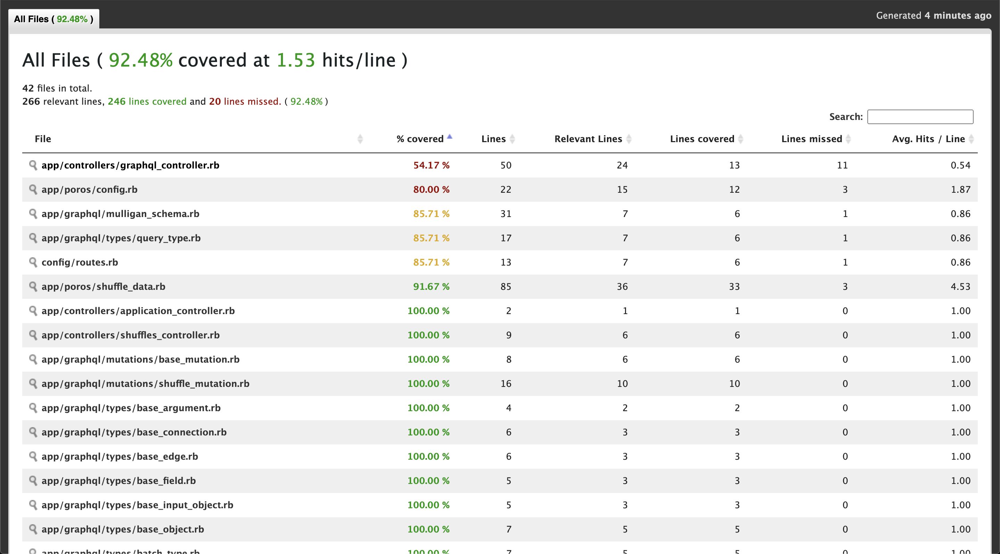
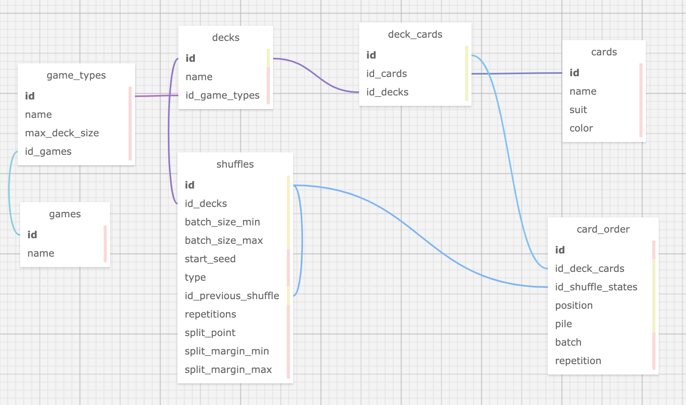

# Mulligan API

A Rails API that provides deterministic simulations of physical card shuffling for use in games, shuffle analysis tools, upping your Magic tournament play, or just plain nerdy curiosity. Consumable via both a GraphQL endpoint and a REST endpoint.

This MVP version of Mulligan API was developed over the cumulative equivalent of two work days using TDD/BDD development methodologies and a top-down design planning process.

## Local deployment

- Pull down branch
- Install Ruby 2.5.3 using Rbenv or RVM
- Open terminal session and `cd` into project directory
- Install dependencies with `bundle install`
- Start the Rails server with `rails s`
- Consume the API through either of two ways:
  - Open [localhost:3000/graphiql](http://localhost:3000/graphiql) in your browser and execute the sample request in GraphiQL
  - Import the example [Postman](https://www.postman.com/) collection included in the repo (Mulligan API.postman_collection.json)

## Testing & coverage

To run the RSpec test suite, run `bundle exec rspec` in the project directory.

Test results as of MVP release:
```
......

Finished in 0.13002 seconds (files took 3.6 seconds to load)
6 examples, 0 failures

Coverage report generated for RSpec to ... 246 / 266 LOC (92.48%) covered.
```



## How it works

At a high level, what the API does is take in a deck of card objects and an array of shuffle request objects, then executes the shuffle requests sequentially. A shuffle request specifies a shuffle type - currently only the traditional "riffle" shuffle is supported - and various parameters that simulate how precise or loose the shuffle is.

In a "riffle" shuffle, the deck is split into two piles semi-randomly, simulated by choosing a "split margin" from with the range from the `split_margin_min` and `max` values in the provided config object and then from a range of that margin negatively and positively from the half-way point of the deck. Then small batches of cards from alternating piles, of a semi-random amount simulated by randomly choosing from a range from `batch_size_min` and `max` and beginning with a randomly selected pile, are interlaced from the bottom to the top, ending with the remainder of the final pile.

To enable a broad range of use of the API, every piece of information about that process is stored and returned to the API consumer, from original config values to actual calculated values to the actual RNG seed used to generate the pseudo-random choices -- which itself can be optionally injected as `random_seed` in the config object for consistency or testing.

## Future iterations & improvements

This repo contains the MVP for the Mulligan API, and one stretch goal: the GraphQL endpoint. There are many more features conceived which were cut to keep MVP achievable:
- Shuffle types beyond riffle (specifically: cut, overhand, piles, and algorithmic).
- Shuffle state, deck, and card CRUD and corresponding queries, mutations, and REST endpoints.
  - (See `database_and_crud` branch for initial work on this, set aside in order to focus on MVP).
- Stats and analysis of differences from original deck and historical stats on shuffle types over time.
- Third-party API integration to import decks from card sources like Scryfall.
- Live remote deployment and CI/CD integration (e.g., Firebase and CircleCI).
- Example FE showcasing shuffle animations made possible by the API's batch information.



Additionally, there are many known weaknesses that could be improved upon:
- Consistent unit testing of all POROs (plain old Ruby objects) and their public and private methods.
- Edge case handling for API request arguments outside reasonable bounds and serialized error objects.
- Refactor ShuffleData shuffle generation method to break code into helper methods.
- OpenAPI spec adherence & serialization for REST endpoint (see `open_api_spec` branch).
- Clean up of boilerplate code generated by Rails, GraphQL, etc.
- If time allowed, shift all core code to a more light-weight framework like Sinatra.

## Example usage

The GraphiQL interface provides living documentation of the API's schema, an example of the request/mutation, and the ability to execute the GraphQL request and see a live response. It's the first place you should go for documentation.

For quick reference, though, here are examples of the GraphQL mutation and the JSON/REST endpoint:

### GraphQL

Endpoint: `POST /graphql`
<details>
<summary>Example Request</summary>

```graphql
mutation {
  shuffle(input: 
    {
      deck: [
        { name: "Ace of Spades" },
        { name: "7 of Diamonds" },
        { name: "Queen of Clubs" },
        { name: "Jack of Hearts" },
        { name: "2 of Clubs" },
        { name: "Ace of Hearts" },
        { name: "8 of Diamonds" },
        { name: "9 of Diamonds" }
      ],
      shuffleRequests: [
        {
          shuffleType: "riffle",
          repetitions: 2,
          config: {
            batchSizeMin: 1,
            batchSizeMax: 2,
            splitMarginMin: 0,
            splitMarginMax: 1,
            randomSeed: 12345
          }
        },
        {
          shuffleType: "riffle",
          repetitions: 1,
          config: {
            batchSizeMin: 1,
            batchSizeMax: 2,
            splitMarginMin: 0,
            splitMarginMax: 1
          }
        }
      ]
    }
  ) {
    deckAfter {
      name
    }
    deckBefore {
      name
    }
    shuffles {
      shuffleType
      config {
        batchSizeMin
        batchSizeMax
        splitMarginMin
        splitMarginMax
        randomSeed
      }
      splitPoint
      finalOrder {
        name
      }
      piles {
        name
      }
      batches {
        number
        sourcePile
        cards {
          name
        }
      }
    }
  }
}
```
</details>

<details>
<summary>Example Response</summary>

```json
{
  "data": {
    "shuffle": {
      "deckAfter": [
        {
          "name": "Queen of Clubs"
        },
        {
          "name": "7 of Diamonds"
        },
        {
          "name": "2 of Clubs"
        },
        {
          "name": "Ace of Spades"
        },
        {
          "name": "Ace of Hearts"
        },
        {
          "name": "Jack of Hearts"
        },
        {
          "name": "8 of Diamonds"
        },
        {
          "name": "9 of Diamonds"
        }
      ],
      "deckBefore": [
        {
          "name": "Ace of Spades"
        },
        {
          "name": "7 of Diamonds"
        },
        {
          "name": "Queen of Clubs"
        },
        {
          "name": "Jack of Hearts"
        },
        {
          "name": "2 of Clubs"
        },
        {
          "name": "Ace of Hearts"
        },
        {
          "name": "8 of Diamonds"
        },
        {
          "name": "9 of Diamonds"
        }
      ],
      "shuffles": [
        {
          "shuffleType": "riffle",
          "config": {
            "batchSizeMin": 1,
            "batchSizeMax": 2,
            "splitMarginMin": 0,
            "splitMarginMax": 1,
            "randomSeed": "12345"
          },
          "splitPoint": 4,
          "finalOrder": [
            {
              "name": "2 of Clubs"
            },
            {
              "name": "Ace of Spades"
            },
            {
              "name": "7 of Diamonds"
            },
            {
              "name": "Ace of Hearts"
            },
            {
              "name": "Queen of Clubs"
            },
            {
              "name": "Jack of Hearts"
            },
            {
              "name": "8 of Diamonds"
            },
            {
              "name": "9 of Diamonds"
            }
          ],
          "piles": [
            [
              {
                "name": "Ace of Spades"
              },
              {
                "name": "7 of Diamonds"
              },
              {
                "name": "Queen of Clubs"
              },
              {
                "name": "Jack of Hearts"
              }
            ],
            [
              {
                "name": "2 of Clubs"
              },
              {
                "name": "Ace of Hearts"
              },
              {
                "name": "8 of Diamonds"
              },
              {
                "name": "9 of Diamonds"
              }
            ]
          ],
          "batches": [
            {
              "number": 5,
              "sourcePile": 2,
              "cards": [
                {
                  "name": "2 of Clubs"
                }
              ]
            },
            {
              "number": 4,
              "sourcePile": 1,
              "cards": [
                {
                  "name": "Ace of Spades"
                },
                {
                  "name": "7 of Diamonds"
                }
              ]
            },
            {
              "number": 3,
              "sourcePile": 2,
              "cards": [
                {
                  "name": "Ace of Hearts"
                }
              ]
            },
            {
              "number": 2,
              "sourcePile": 1,
              "cards": [
                {
                  "name": "Queen of Clubs"
                },
                {
                  "name": "Jack of Hearts"
                }
              ]
            },
            {
              "number": 1,
              "sourcePile": 2,
              "cards": [
                {
                  "name": "8 of Diamonds"
                },
                {
                  "name": "9 of Diamonds"
                }
              ]
            }
          ]
        },
        {
          "shuffleType": "riffle",
          "config": {
            "batchSizeMin": 1,
            "batchSizeMax": 2,
            "splitMarginMin": 0,
            "splitMarginMax": 1,
            "randomSeed": "12345"
          },
          "splitPoint": 4,
          "finalOrder": [
            {
              "name": "Queen of Clubs"
            },
            {
              "name": "2 of Clubs"
            },
            {
              "name": "Ace of Spades"
            },
            {
              "name": "Jack of Hearts"
            },
            {
              "name": "7 of Diamonds"
            },
            {
              "name": "Ace of Hearts"
            },
            {
              "name": "8 of Diamonds"
            },
            {
              "name": "9 of Diamonds"
            }
          ],
          "piles": [
            [
              {
                "name": "2 of Clubs"
              },
              {
                "name": "Ace of Spades"
              },
              {
                "name": "7 of Diamonds"
              },
              {
                "name": "Ace of Hearts"
              }
            ],
            [
              {
                "name": "Queen of Clubs"
              },
              {
                "name": "Jack of Hearts"
              },
              {
                "name": "8 of Diamonds"
              },
              {
                "name": "9 of Diamonds"
              }
            ]
          ],
          "batches": [
            {
              "number": 5,
              "sourcePile": 2,
              "cards": [
                {
                  "name": "Queen of Clubs"
                }
              ]
            },
            {
              "number": 4,
              "sourcePile": 1,
              "cards": [
                {
                  "name": "2 of Clubs"
                },
                {
                  "name": "Ace of Spades"
                }
              ]
            },
            {
              "number": 3,
              "sourcePile": 2,
              "cards": [
                {
                  "name": "Jack of Hearts"
                }
              ]
            },
            {
              "number": 2,
              "sourcePile": 1,
              "cards": [
                {
                  "name": "7 of Diamonds"
                },
                {
                  "name": "Ace of Hearts"
                }
              ]
            },
            {
              "number": 1,
              "sourcePile": 2,
              "cards": [
                {
                  "name": "8 of Diamonds"
                },
                {
                  "name": "9 of Diamonds"
                }
              ]
            }
          ]
        },
        {
          "shuffleType": "riffle",
          "config": {
            "batchSizeMin": 1,
            "batchSizeMax": 2,
            "splitMarginMin": 0,
            "splitMarginMax": 1,
            "randomSeed": "193827217323898606139958163848066750903"
          },
          "splitPoint": 4,
          "finalOrder": [
            {
              "name": "Queen of Clubs"
            },
            {
              "name": "7 of Diamonds"
            },
            {
              "name": "2 of Clubs"
            },
            {
              "name": "Ace of Spades"
            },
            {
              "name": "Ace of Hearts"
            },
            {
              "name": "Jack of Hearts"
            },
            {
              "name": "8 of Diamonds"
            },
            {
              "name": "9 of Diamonds"
            }
          ],
          "piles": [
            [
              {
                "name": "Queen of Clubs"
              },
              {
                "name": "2 of Clubs"
              },
              {
                "name": "Ace of Spades"
              },
              {
                "name": "Jack of Hearts"
              }
            ],
            [
              {
                "name": "7 of Diamonds"
              },
              {
                "name": "Ace of Hearts"
              },
              {
                "name": "8 of Diamonds"
              },
              {
                "name": "9 of Diamonds"
              }
            ]
          ],
          "batches": [
            {
              "number": 6,
              "sourcePile": 1,
              "cards": [
                {
                  "name": "Queen of Clubs"
                }
              ]
            },
            {
              "number": 5,
              "sourcePile": 2,
              "cards": [
                {
                  "name": "7 of Diamonds"
                }
              ]
            },
            {
              "number": 4,
              "sourcePile": 1,
              "cards": [
                {
                  "name": "2 of Clubs"
                },
                {
                  "name": "Ace of Spades"
                }
              ]
            },
            {
              "number": 3,
              "sourcePile": 2,
              "cards": [
                {
                  "name": "Ace of Hearts"
                }
              ]
            },
            {
              "number": 2,
              "sourcePile": 1,
              "cards": [
                {
                  "name": "Jack of Hearts"
                }
              ]
            },
            {
              "number": 1,
              "sourcePile": 2,
              "cards": [
                {
                  "name": "8 of Diamonds"
                },
                {
                  "name": "9 of Diamonds"
                }
              ]
            }
          ]
        }
      ]
    }
  }
}
```
</details>

### REST

Endpoint: `POST /shuffle`
<details>
<summary>Example JSON Request Body</summary>

```json
{
  "deck": [
    {
      "name": "Ace of Spades"
    },
    {
      "name": "7 of Diamonds"
    },
    {
      "name": "Queen of Clubs"
    },
    {
      "name": "Jack of Hearts"
    },
    {
      "name": "2 of Clubs"
    },
    {
      "name": "Ace of Hearts"
    },
    {
      "name": "8 of Diamonds"
    },
    {
      "name": "9 of Diamonds"
    }
  ],
  "shuffle_requests": [
    {
      "shuffle_type": "riffle",
      "repetitions": 1,
      "config": {
        "batch_size_min": 1,
        "batch_size_max": 2,
        "split_margin_min": 0,
        "split_margin_max": 1,
        "random_seed": 12345
      }
    },
    {
      "shuffle_type": "riffle",
      "repetitions": 3,
      "config": {
        "batch_size_min": 1,
        "batch_size_max": 5,
        "split_margin_min": 0,
        "split_margin_max": 2
      }
    }
  ]
}
```
</details>

<details>
<summary>Example Response</summary>

```json
{
  "deck_before": [
    {
      "name": "Ace of Spades"
    },
    {
      "name": "7 of Diamonds"
    },
    {
      "name": "Queen of Clubs"
    },
    {
      "name": "Jack of Hearts"
    },
    {
      "name": "2 of Clubs"
    },
    {
      "name": "Ace of Hearts"
    },
    {
      "name": "8 of Diamonds"
    },
    {
      "name": "9 of Diamonds"
    }
  ],
  "deck_after": [
    {
      "name": "Jack of Hearts"
    },
    {
      "name": "7 of Diamonds"
    },
    {
      "name": "Ace of Hearts"
    },
    {
      "name": "Queen of Clubs"
    },
    {
      "name": "2 of Clubs"
    },
    {
      "name": "8 of Diamonds"
    },
    {
      "name": "Ace of Spades"
    },
    {
      "name": "9 of Diamonds"
    }
  ],
  "shuffles": [
    {
      "shuffle_type": "riffle",
      "config": {
        "batch_size_min": 1,
        "batch_size_max": 2,
        "split_margin_min": 0,
        "split_margin_max": 1,
        "random_seed": 12345,
        "rng": {}
      },
      "split_point": 4,
      "final_order": [
        {
          "name": "2 of Clubs"
        },
        {
          "name": "Ace of Spades"
        },
        {
          "name": "7 of Diamonds"
        },
        {
          "name": "Ace of Hearts"
        },
        {
          "name": "Queen of Clubs"
        },
        {
          "name": "Jack of Hearts"
        },
        {
          "name": "8 of Diamonds"
        },
        {
          "name": "9 of Diamonds"
        }
      ],
      "piles": [
        [
          {
            "name": "Ace of Spades"
          },
          {
            "name": "7 of Diamonds"
          },
          {
            "name": "Queen of Clubs"
          },
          {
            "name": "Jack of Hearts"
          }
        ],
        [
          {
            "name": "2 of Clubs"
          },
          {
            "name": "Ace of Hearts"
          },
          {
            "name": "8 of Diamonds"
          },
          {
            "name": "9 of Diamonds"
          }
        ]
      ],
      "batches": [
        {
          "number": 5,
          "source_pile": 2,
          "cards": [
            {
              "name": "2 of Clubs"
            }
          ]
        },
        {
          "number": 4,
          "source_pile": 1,
          "cards": [
            {
              "name": "Ace of Spades"
            },
            {
              "name": "7 of Diamonds"
            }
          ]
        },
        {
          "number": 3,
          "source_pile": 2,
          "cards": [
            {
              "name": "Ace of Hearts"
            }
          ]
        },
        {
          "number": 2,
          "source_pile": 1,
          "cards": [
            {
              "name": "Queen of Clubs"
            },
            {
              "name": "Jack of Hearts"
            }
          ]
        },
        {
          "number": 1,
          "source_pile": 2,
          "cards": [
            {
              "name": "8 of Diamonds"
            },
            {
              "name": "9 of Diamonds"
            }
          ]
        }
      ]
    },
    {
      "shuffle_type": "riffle",
      "config": {
        "batch_size_min": 1,
        "batch_size_max": 5,
        "split_margin_min": 0,
        "split_margin_max": 2,
        "random_seed": 64237846204406287805227776216539535349,
        "rng": {}
      },
      "split_point": 5,
      "final_order": [
        {
          "name": "Jack of Hearts"
        },
        {
          "name": "2 of Clubs"
        },
        {
          "name": "Ace of Spades"
        },
        {
          "name": "7 of Diamonds"
        },
        {
          "name": "8 of Diamonds"
        },
        {
          "name": "9 of Diamonds"
        },
        {
          "name": "Ace of Hearts"
        },
        {
          "name": "Queen of Clubs"
        }
      ],
      "piles": [
        [
          {
            "name": "2 of Clubs"
          },
          {
            "name": "Ace of Spades"
          },
          {
            "name": "7 of Diamonds"
          },
          {
            "name": "Ace of Hearts"
          },
          {
            "name": "Queen of Clubs"
          }
        ],
        [
          {
            "name": "Jack of Hearts"
          },
          {
            "name": "8 of Diamonds"
          },
          {
            "name": "9 of Diamonds"
          }
        ]
      ],
      "batches": [
        {
          "number": 4,
          "source_pile": 2,
          "cards": [
            {
              "name": "Jack of Hearts"
            }
          ]
        },
        {
          "number": 3,
          "source_pile": 1,
          "cards": [
            {
              "name": "2 of Clubs"
            },
            {
              "name": "Ace of Spades"
            },
            {
              "name": "7 of Diamonds"
            }
          ]
        },
        {
          "number": 2,
          "source_pile": 2,
          "cards": [
            {
              "name": "8 of Diamonds"
            },
            {
              "name": "9 of Diamonds"
            }
          ]
        },
        {
          "number": 1,
          "source_pile": 1,
          "cards": [
            {
              "name": "Ace of Hearts"
            },
            {
              "name": "Queen of Clubs"
            }
          ]
        }
      ]
    },
    {
      "shuffle_type": "riffle",
      "config": {
        "batch_size_min": 1,
        "batch_size_max": 5,
        "split_margin_min": 0,
        "split_margin_max": 2,
        "random_seed": 10874429418734923643496367191670108594,
        "rng": {}
      },
      "split_point": 3,
      "final_order": [
        {
          "name": "Jack of Hearts"
        },
        {
          "name": "7 of Diamonds"
        },
        {
          "name": "8 of Diamonds"
        },
        {
          "name": "9 of Diamonds"
        },
        {
          "name": "Ace of Hearts"
        },
        {
          "name": "Queen of Clubs"
        },
        {
          "name": "2 of Clubs"
        },
        {
          "name": "Ace of Spades"
        }
      ],
      "piles": [
        [
          {
            "name": "Jack of Hearts"
          },
          {
            "name": "2 of Clubs"
          },
          {
            "name": "Ace of Spades"
          }
        ],
        [
          {
            "name": "7 of Diamonds"
          },
          {
            "name": "8 of Diamonds"
          },
          {
            "name": "9 of Diamonds"
          },
          {
            "name": "Ace of Hearts"
          },
          {
            "name": "Queen of Clubs"
          }
        ]
      ],
      "batches": [
        {
          "number": 3,
          "source_pile": 1,
          "cards": [
            {
              "name": "Jack of Hearts"
            }
          ]
        },
        {
          "number": 2,
          "source_pile": 2,
          "cards": [
            {
              "name": "7 of Diamonds"
            },
            {
              "name": "8 of Diamonds"
            },
            {
              "name": "9 of Diamonds"
            },
            {
              "name": "Ace of Hearts"
            },
            {
              "name": "Queen of Clubs"
            }
          ]
        },
        {
          "number": 1,
          "source_pile": 1,
          "cards": [
            {
              "name": "2 of Clubs"
            },
            {
              "name": "Ace of Spades"
            }
          ]
        }
      ]
    },
    {
      "shuffle_type": "riffle",
      "config": {
        "batch_size_min": 1,
        "batch_size_max": 5,
        "split_margin_min": 0,
        "split_margin_max": 2,
        "random_seed": 42362629860148277572734265953397810830,
        "rng": {}
      },
      "split_point": 4,
      "final_order": [
        {
          "name": "Jack of Hearts"
        },
        {
          "name": "7 of Diamonds"
        },
        {
          "name": "Ace of Hearts"
        },
        {
          "name": "Queen of Clubs"
        },
        {
          "name": "2 of Clubs"
        },
        {
          "name": "8 of Diamonds"
        },
        {
          "name": "Ace of Spades"
        },
        {
          "name": "9 of Diamonds"
        }
      ],
      "piles": [
        [
          {
            "name": "Jack of Hearts"
          },
          {
            "name": "7 of Diamonds"
          },
          {
            "name": "8 of Diamonds"
          },
          {
            "name": "9 of Diamonds"
          }
        ],
        [
          {
            "name": "Ace of Hearts"
          },
          {
            "name": "Queen of Clubs"
          },
          {
            "name": "2 of Clubs"
          },
          {
            "name": "Ace of Spades"
          }
        ]
      ],
      "batches": [
        {
          "number": 5,
          "source_pile": 1,
          "cards": [
            {
              "name": "Jack of Hearts"
            },
            {
              "name": "7 of Diamonds"
            }
          ]
        },
        {
          "number": 4,
          "source_pile": 2,
          "cards": [
            {
              "name": "Ace of Hearts"
            },
            {
              "name": "Queen of Clubs"
            },
            {
              "name": "2 of Clubs"
            }
          ]
        },
        {
          "number": 3,
          "source_pile": 1,
          "cards": [
            {
              "name": "8 of Diamonds"
            }
          ]
        },
        {
          "number": 2,
          "source_pile": 2,
          "cards": [
            {
              "name": "Ace of Spades"
            }
          ]
        },
        {
          "number": 1,
          "source_pile": 1,
          "cards": [
            {
              "name": "9 of Diamonds"
            }
          ]
        }
      ]
    }
  ]
}
```
</details>